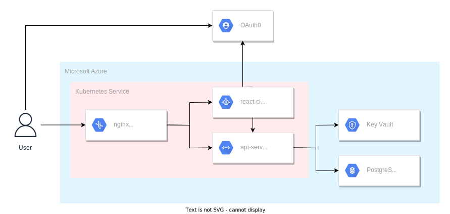
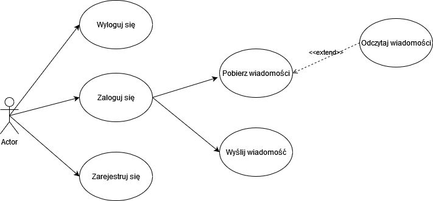
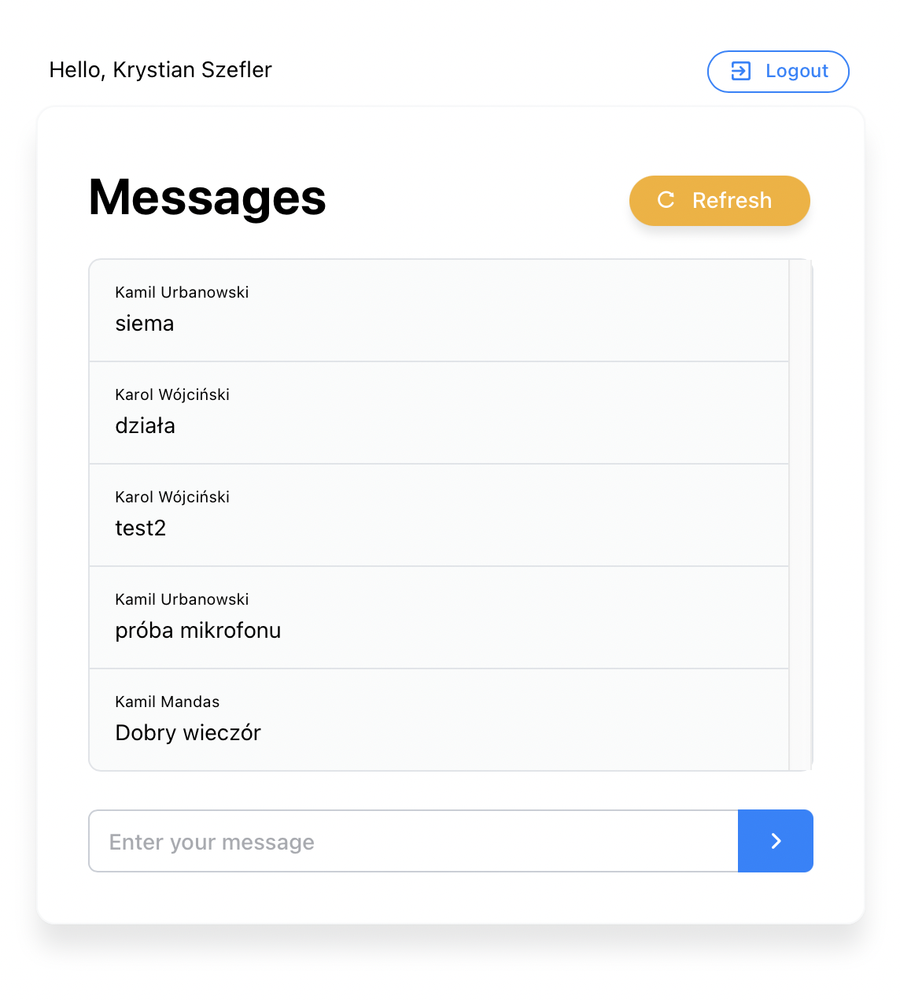
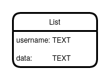

# Programming Of Cloud Services

Hello to our little ☁ project.

# How to start

## Prerequisites
npm, docker-desktop, kubectl

## Local dev

1. Install dependencies in /server and /client by running "npm i" in them
2. Run docker-compose up --build to build it and deploy containers in docker
3. Access via localhost:3050

## K8s run

1. Verify if kubectl is installed ("kubectl version")
1. Enable Kubernetes in docker-desktop (settings -> kubernetes)
2. In Docker set Kubernetes context to docker-desktop (after that check with "kubectl config get-contexts")
3. After all that command "kubectl get all" should point to default namespace in docker-desktop context 
    and there should be a service/kubernetes resource or something.
4. Run "kubectl apply -f https://raw.githubusercontent.com/kubernetes/ingress-nginx/controller-v1.0.4/deploy/static/provider/cloud/deploy.yaml" to 
    install nginx ingress for routing.
5. In root folder of the project ("ProgrammingOfCloudServices") run "kubectl apply -f manifests"
6. Enjoy on localhost (without the port).

## Common problems

If you are switching from docker-compose to running a kubernetes cluster you have to run "docker-compose down" because ingresses will clash.
The other way around to switch from k8s cluster to docker-compose way you have to run:
"kubectl delete -f manifests" and "kubectl delete -f  https://raw.githubusercontent.com/kubernetes/ingress-nginx/controller-v1.0.4/deploy/static/provider/cloud/deploy.yaml".

# Dokumentacja

## Wstęp

Tematem naszego projektu jest aplikacja do dystrybuowania wiadomości na wspólnym kanale pomiędzy zarejestrowanymi użytkownikami. W trakcie naszej pracy będziemy korzystać z githuba jako naszego repozytorium i Portalu Azure do zarządzania usługami w chmurze. W skład zespołu wchodzą:

- Kamil Mandas (backend)
- Kamil Urbanowski (dev-ops)
- Przemysław Rawa (baza danych)
- Krystian Szefler (frontend, dokumentacja)
- Karol Wójciński (autoryzacja, dokumentacja)

## Architektura

Każdy element systemu jest kontenerem Docker a do zarządzania nimi jest wykorzystany Kubernetes. System jest zbudowany z następujących elementów:
1.	**Serwera proxy** *nginx* którego zadaniem jest przekierowanie żądań klienta do odpowiednich Podów.
2.	**Frontend** w postaci *Reacta* do iterakcji z użytkownikiem.
3.	**Backend** na silniku *Node.js* z frameworkiem *Express* pozwalającym na łatwe zbudowanie REST API dla frontendu.
4.	**Baza danych** *PostgreSQL* na której przechowywane są wiadomości.
5.  **Key Vault** do przechowywania hasła do bazy danych
6.  **OAuth0** służący do autoryzacji użytkownika

## Lokalne środowisko

Lokalny development prowadzony był przy pomocy konteneryzacji używając do tego dockera oraz zbierając całą architekturę w opisujący ją plik docker-compose. Zawiera kod umożliwiający wdrożenie nginx jako ingress controller, postgresa jako bazy danych oraz zaimplementowanych przez nas aplikacji frontendowej i backendowej. Opis budowania  tych aplikacji zawarty jest w plikach Dockerfile.dev. 

Wykorzystując konteneryzacje pozbywamy się zależności od maszyn, na których uruchamiany jest cały projekt.

Końcowa struktura aplikacji wykorzystuje klaster kubernetesowy do wdrażania aplikacji i jest również możliwość przetesowania jej lokalnie
  

## Przypadki użycia

Aplikacja ma służyć do dystrybuowania wiadomości na wspólnym kanale pomiędzy zarejestrowanymi użytkownikami.

## Autoryzacja

Jako narzędzie do autoryzacji wykorzystaliśmy auth0. Wybraliśmy darmową usługę zamiast tej oferowanej przez Azure ze względu na rosnące koszty naszego rozwiązania i ograniczony budżet. Auth0 oferuje darmowe korzystanie z usługi do 7000 użytkowników co w zupełności nam wystarczyło. Konfiguracja autoryzacji nie sprawiła żadnych problemów. Wystarczyło dodać aplikację w usłudze auth0, skonfigurować ją (dodać adres naszej aplikacji i ustawić typ aplikacji) oraz do naszej aplikacji webowej podać odpowiednie parametry przekazane przez auth0. Następnie korzystając z Reacta pozostało dostosować naszą aplikacje do podanego rozwiązania. Poniżej częściowy widok konfiguracji aplikacji w auth0:

Jak widzimy powyżej dodaliśmy nasze lokalne adresy w celach testowych oraz adres naszej aplikacji postawionej w chmurze.

## Backend

Do zbudowania backendu posłużył framework *Express*, który pozwala budować aplikacje backendowe przy pomocy node.js. Wybór tego rozwiązania oparty był głównie na jego minimalizmie oraz lekkości.
Sama aplikacja backendowa służy do komunikacji z bazą danych aby wykonywać operacje na danych oraz publikuje endpointy, z którymi komunikuje się frontend przy pomoci REST API.
Kod dwóch podstawowych funkcjonalności (zapis wiadomości oraz pobranie wszystkich wiadomości):

## Frontend

Do zbudowania frontendu posłużył *React*.Komunikuje się on z backendem przy pomocy REST API. Do budowy interfejsu został użyty framework [Atomize](https://atomizecode.com).

## Key Vault

W celu bezpiecznego zarządzania hasłem do bazy danych, wykorzystana została usług Azure'a o nazwie Key Vault. Umożliwia ona przechowywanie kluczy i tajnych wpisów, nad którymi użytkownik ma pełną kontrolę - może on udzielić uprawnień swoim aplikacjom czy też aplikacjom partnerów, aby mogli oni uzyskać bezporśredni dostęp do kluczy. Microsoft nie ma dostępu do kluczy i nie ma możliwośći ich wyodrębniania, co świadczy o prywatności świadczonej usługi. Dodatkowowo przechowywanie kluczy kryptograficznych w chmurze, a nie lokalnie, pozwala zwiększyć wydajność i zmniejszyć opóźnienia aplikacji w chmurze. Na poniższym screenshocie został przedstawiony widok na tajny wpis zawierający hasło do naszej bazy danych:

## Usługa Kubernetes
Cała aplikacja została postawiona w ramach usługi Kubernetes:

## Baza danych

Utworzona baza danych operuje w oparciu o silnik PostgreSQL w wersji 11.
Nie wykorzystaliśmy najnowszej, czternastej, wersji tego silnika, gdyż chmura Azure nie pozwoliła nam w zadanym budżecie takiego silnika wybrać.

W celu zaoszczędzenia pieniędzy, ustawiliśmy limit przechowywanych danych na 100GB.
Nie wyłączaliśmy jednak domyślnie uruchomionej funkcji automatycznego zwiększania dostępnego dysku w przypadku wykorzystania całego dostępnego.

Redundancja danych została ustawiona na lokalną.
Lokalizacja serwera została ustawiona na Francję, dzięki czemu mogliśmy uzyskać mniejsze opóźnienia niż w przypadku serwerów w Stanach Zjednoczonych.

Pricing model został ustawiony na General Purpose.
Zapewnia on stałą wydajność IO w przeciwieństwie do Basic.
Jest on niestety znacznie droższy.

Baza danych utworzona w czasie realizacji projektu składa się z tabeli przechowującej wiadomości.
Pojedynczy rekord w tej tablie przechowuje nazwę użytkownika oraz treść wiadomości.
Obydwie kolumny tej tabeli mogą przechowywać aż do 1GB danych (ograniczenie narzucone przez architekturę silnika bazy danych).

  

## Problemy

W trakcie pracy nad projektem spotkaliśmy się z jednym problem, jednak bardzo istotnym, jakim są koszta. Usługi i serwisy z których korzystamy lub chcieliśmy skorzystać okazały się bardzo drogie w utrzymaniu, przez co nasz projekt nie może być uruchomiony cały czas i jest włączany na czas testów czy przygotowania sprawozdania. By zoptymalizować koszty skorzystaliśmy z zewnętrznego serwisu do autoryzacji - auth0, który jest darmowy do 7000 użytkowników. Zrezygnowaliśmy również z automatycznego odświeżania wiadomości.

## Wnioski

Podsumowując projekt został zakończony pomyślnie. Mimo problemów związanych z kosztami udało nam się je w pewien sposób obejść i dostarczyć gotowy produkt. Sam proces tworzenia aplikacji przebiegł również bezproblemowo. Do podziału pracy i jej przebiegu skorzystaliśmy z tablicy kanban wbudowanej w rozwiązanie github. Większość komunikacji odbywała się jednak w aplikacji Messenger czy MS Teams. Dobra komunikacja i efektywny podział pracy pozwolił każdemu z nas na zajęcie się tematem, który najbardziej go interesował i w którym czuł się najlepiej co zaowocowało gotowym, chmurowym produktem.

W trakcie realizacji projektu doszliśmy jednak do wniosku, że platforma Azure nie jest przyjazna dla firm bez specjalisty od usług Azure.
Podczas konfiguracji bazy danych większość domyślnych opcji odpowiadała najdroższym możliwym opcjom.
Część domyślnie włączonych możliwości mogących wpływać na koszt usługi, takich jak na przykład automatyczne powiększanie dysku po wyczerpaniu limitu, nie może być wyłączona w trakcie tworzenia usługi a dopiero po jej utworzeniu. 

Po stworzeniu bazy danych PostgreSQL zauważyliśmy również, że estymowany koszt działania bazy potrafi być bardzo niejednoznaczy.
W naszym przypadku w trakcie tworzenia tej bazy Azure wyliczył koszt działania na 25$ miesięcznie.
Po zapisaniu danych odpowiadających 0.12% pojemności bazy danych okazało się jednak, że taka baza jest estymowana na 434.05$ miesięcznie.

Odkryliśmy również, że Azure próbuje zamnkąć użytkowników w swoim środowisku utrudniając przeniesienie swoich danych do konkurencji lub na własne serwery.
Przykładem takich operacji jest dla dyskryminowanie cenowo popularnych, otwartych silników baz danych poprzez manipulację cen w celu promocji własnego, własnościowego silnika.
Samo działanie bez przechowywania jakichkolwiek danych silnika PostgreSQL przy minimalnych ustawieniach kosztuje około 20$.
Dla porównania, silnik Azure SQL w takiej samej sytuacji nie pobiera opłat.
W tym przypadku różnica cenowa nie jest gigantyczna.
Samo jednak jej istnienie może przekonać niedoświadczoną techincznie firmę do wybrania własnościowego silnika Azure SQL, przez co w przyszłości będą musieli ponieść dodatkowe koszty związane z przepisywaniem niekompatybilnej logiki biznesowej.
Takie postępowanie ze strony Azure jako korporacji jest zrozumiałe, lecz uważamy, że jest to bardzo wrogie dla konsumenta. 
